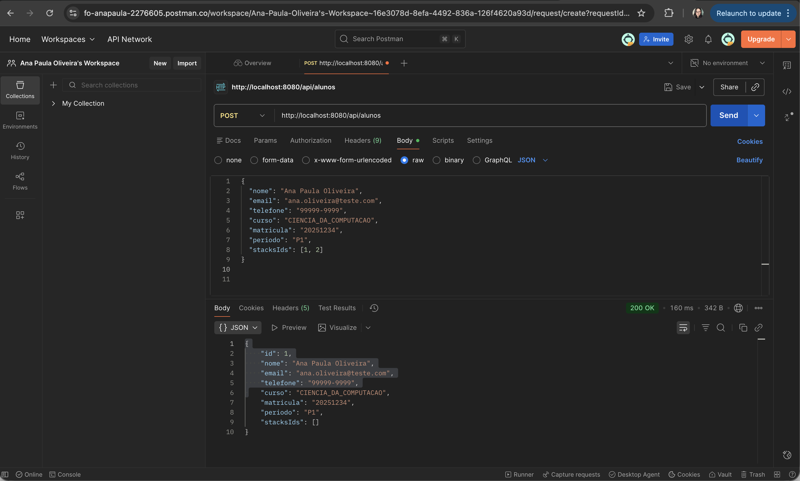
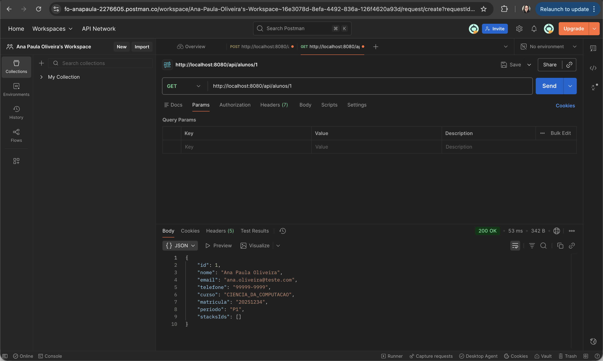
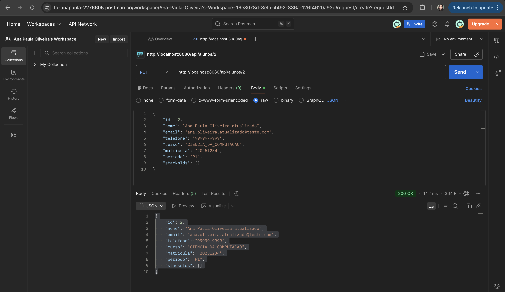
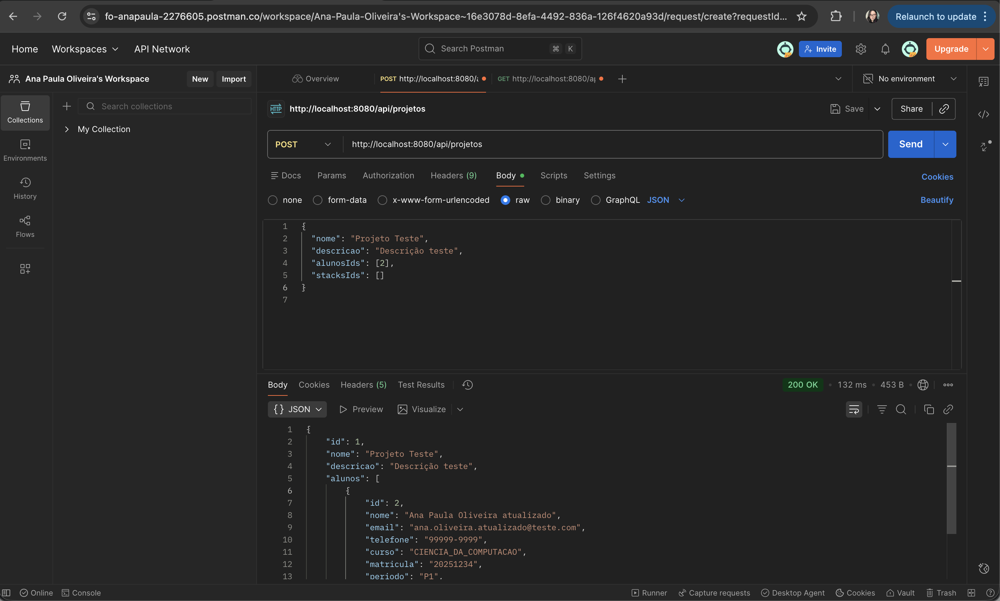
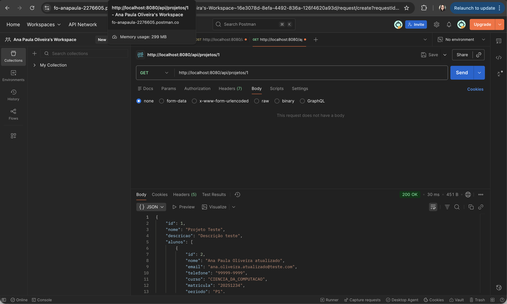
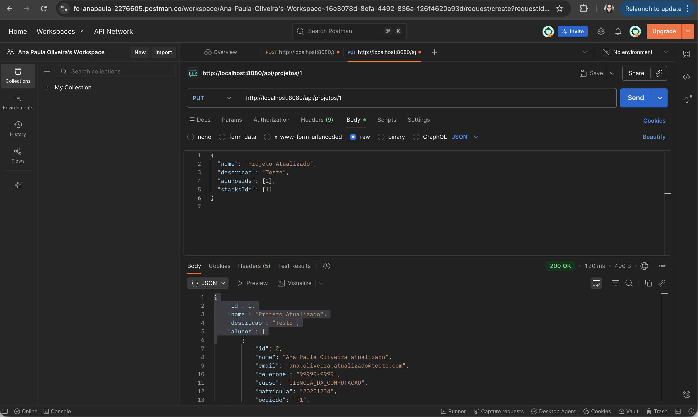
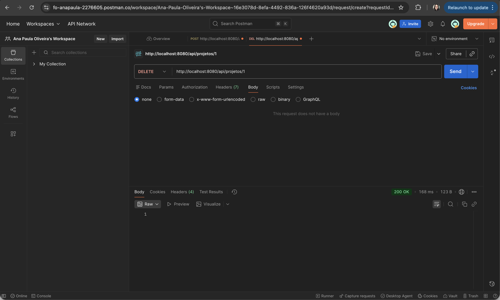

# READ ME

## Projeto Fábrica de Software
###### Projeto realizado para obtenção de nota no componente curricular BackEnd Avançado do curso Sistemas para Internet.
## Grupo
###### Ana Carolina Cartaxo
###### Ana Paula Oliveira
###### Ana Luiza Britto
## Evidências
###### Prints do CRUD de Aluno e Projeto (via Postman)
## CRUD ALUNO
#### POST ALUNO

#### GET ALUNO BY ID

#### PUT ALUNO

#### DELETE ALUNO

## CRUD PROJETO
#### POST PROJETO

#### GET PROJETO BY ID

#### PUT PROJETO

#### DELETE PROJETO
